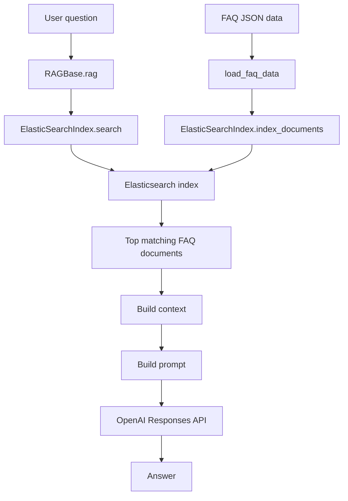
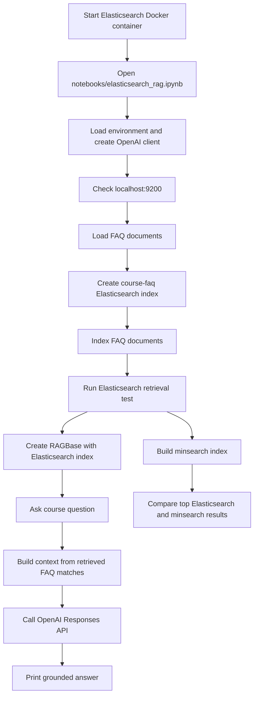

# Elasticsearch Retrieval Layer

This project can use Elasticsearch as a learning-oriented retrieval layer alongside the current `minsearch` index.

The main idea is to keep the RAG pipeline stable:

```text
question -> retriever.search() -> context -> prompt -> LLM -> answer
```

Only the retriever changes:

```text
minsearch.Index
```

can be replaced with:

```text
ElasticSearchIndex
```

## Why Add Elasticsearch?

Elasticsearch is useful for learning production-style retrieval concepts:

- explicit index mappings
- full-text search over multiple fields
- field boosting
- keyword filters
- inspecting search scores and hits
- running a retriever as a separate service

## Architecture



## Start Elasticsearch

For local learning, run Elasticsearch with Docker. Keep this terminal open while working with the notebook:

```bash
docker run -it \
  --rm \
  --name elasticsearch \
  -p 9200:9200 \
  -p 9300:9300 \
  -e "discovery.type=single-node" \
  -e "xpack.security.enabled=false" \
  docker.elastic.co/elasticsearch/elasticsearch:8.15.0
```

The first run downloads the Docker image, so it can take a few minutes. After startup, Elasticsearch prints JSON logs in the terminal.

Check that it is running:

```bash
curl http://localhost:9200
```

Expected response:

```json
{
  "cluster_name": "docker-cluster",
  "version": {
    "number": "8.15.0"
  },
  "tagline": "You Know, for Search"
}
```

If `docker` is not available inside WSL, enable Docker Desktop WSL integration:

1. Open Docker Desktop on Windows.
2. Go to Settings > Resources > WSL Integration.
3. Enable integration for the active WSL distro.
4. Restart Docker Desktop.
5. Run `docker --version` and `docker ps` in WSL.

## Notebook Workflow

Use this notebook for the Elasticsearch experiment:

```text
notebooks/elasticsearch_rag.ipynb
```

Keep `notebooks/rag_cleaned.ipynb` as a minimal OpenAI smoke test. The Elasticsearch notebook is the place to load FAQ data, index it into Elasticsearch, compare retrieval, and run RAG.

Run the notebook cells in order:

1. Setup imports, project path, `.env`, and OpenAI client.
2. Check that Elasticsearch is reachable at `http://localhost:9200`.
3. Load FAQ documents with `load_faq_data()`.
4. Create and populate the Elasticsearch index.
5. Run a direct retrieval test.
6. Run `RAGBase` using Elasticsearch.
7. Compare Elasticsearch results with `minsearch`.



## Build the Elasticsearch Index

Use the existing FAQ loader and the new `ElasticSearchIndex` wrapper:

```python
from ingest import load_faq_data
from elastic_search import ElasticSearchIndex

documents = load_faq_data()

es_index = ElasticSearchIndex(index_name="course-faq")
es_index.create_index(recreate=True)
es_index.index_documents(documents)
```

## Search Directly

```python
results = es_index.search(
    query="Can I still join the course?",
    filter_dict={"course": "llm-zoomcamp"},
    boost_dict={"question": 3.0, "section": 0.5},
    num_results=5,
)

results[0]
```

The wrapper uses a `multi_match` query with `best_fields`, similar to the LLM Zoomcamp Elasticsearch notes.

## Use Elasticsearch With `RAGBase`

Because `ElasticSearchIndex.search()` accepts the same arguments as the current `minsearch` index, `RAGBase` can use it directly:

```python
from dotenv import load_dotenv
from openai import OpenAI

from ingest import load_faq_data
from elastic_search import ElasticSearchIndex
from rag_helper import RAGBase

load_dotenv(".env")

documents = load_faq_data()

es_index = ElasticSearchIndex(index_name="course-faq")
es_index.create_index(recreate=True)
es_index.index_documents(documents)

openai_client = OpenAI()

assistant = RAGBase(
    index=es_index,
    llm_client=openai_client,
)

answer = assistant.rag("I just discovered the course. Can I join now?")
print(answer)
```

## Compare Retrieval Backends

| Area | `minsearch` | Elasticsearch |
| --- | --- | --- |
| Setup | In-process Python object | Separate local service |
| Persistence | Rebuilt in memory | Indexed into Elasticsearch |
| Query style | Python method call | HTTP search API |
| Filtering | `filter_dict` | `term` filter |
| Field boosting | `boost_dict` | `question^3.0`, `section^0.5` |
| Best for | Fast course exercises | Learning production-style search |

## Learning Exercise

Try the same question with both indexes:

```python
question = "I just discovered the course. Can I join now?"
```

Compare:

- top 5 retrieved documents
- whether the same FAQ appears first
- how changing `question` boost changes ranking
- how filtering by `course` changes results

## Troubleshooting

If `http://localhost:9200` does not load:

- Confirm the Docker terminal is still running.
- Run `docker ps` and check that a container named `elasticsearch` is active.
- Wait 30-90 seconds after container startup, because Elasticsearch can take time to become ready.
- Check container logs with `docker logs elasticsearch`.

If the notebook cannot import project modules:

- Start Jupyter from the project root, or use `notebooks/elasticsearch_rag.ipynb`, which adds the project root to `sys.path`.
- Confirm the files exist: `ingest.py`, `elastic_search.py`, and `rag_helper.py`.

If the RAG answer fails but retrieval works:

- Confirm `.env` contains `OPENAI_API_KEY`.
- Restart the notebook kernel and run cells from the top.
- Test the OpenAI client separately with `notebooks/rag_cleaned.ipynb`.

## Stopping Elasticsearch

Stop the Docker container with `Ctrl+C` in the terminal where it is running.

Because the example command uses `--rm`, Docker removes the container after it stops. Re-run the `docker run` command when you want to start Elasticsearch again.
