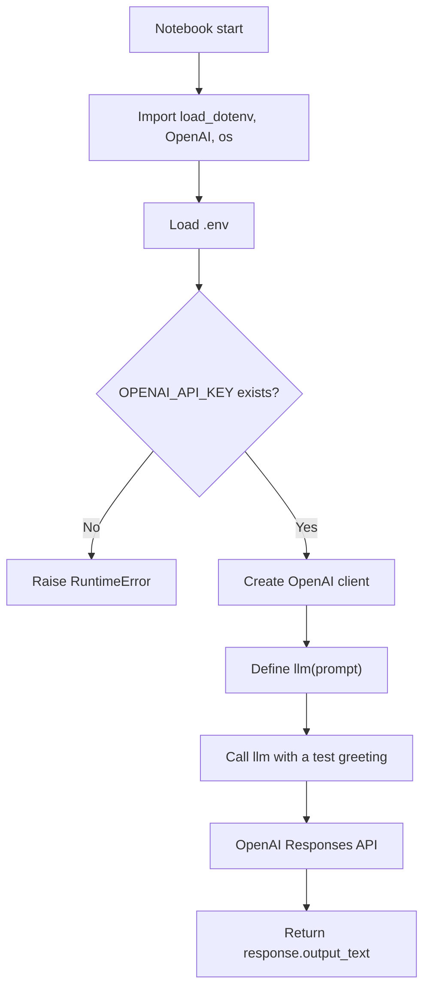
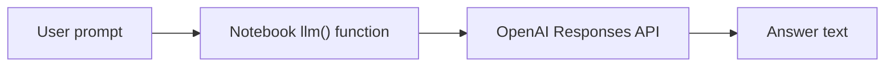
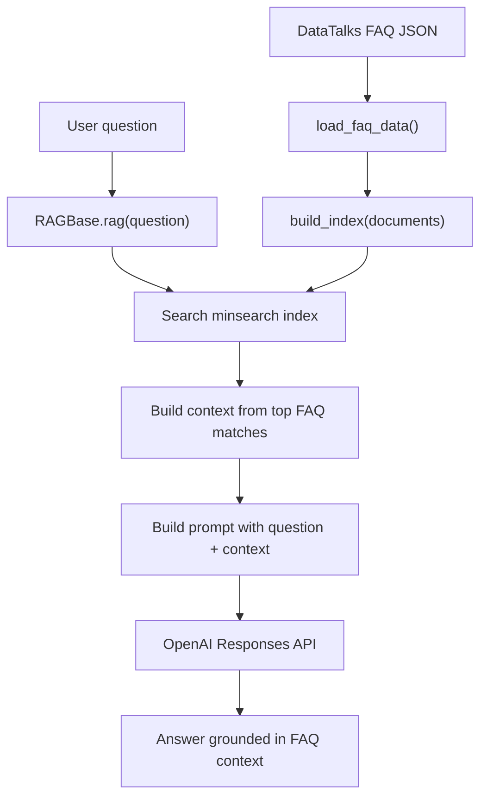
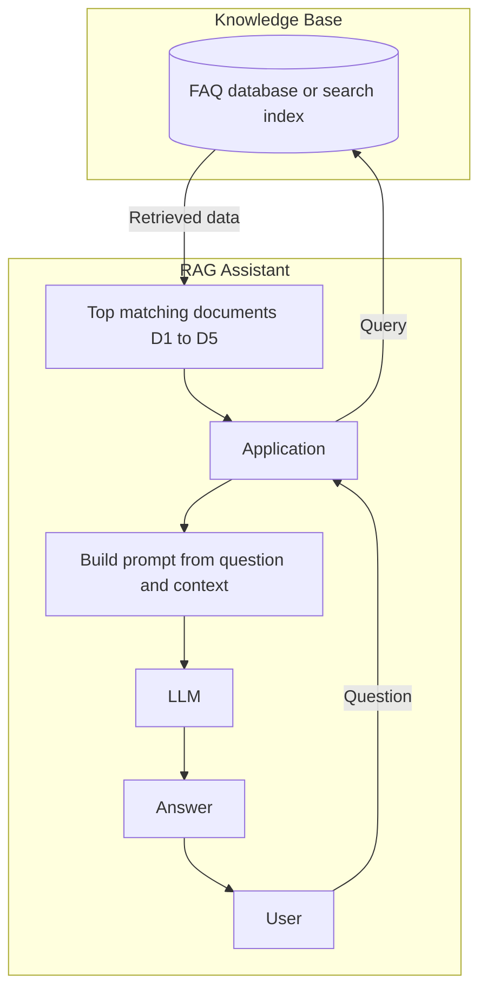

# RAG Notebook Architecture Comparison

This document compares the current saved versions of:

- `notebooks/rag_cleaned.ipynb`
- `notebooks/RAG_helper.ipynb`

Both notebooks currently implement the same simple OpenAI call flow. They do not yet run the full RAG pipeline from `ingest.py` and `rag_helper.py`.

## `notebooks/rag_cleaned.ipynb`



## `notebooks/RAG_helper.ipynb`


## Comparison

| Area | `notebooks/rag_cleaned.ipynb` | `notebooks/RAG_helper.ipynb` | Difference |
| --- | --- | --- | --- |
| Environment loading | Uses `load_dotenv(".env")` | Uses `load_dotenv(".env")` | None |
| API client | Creates `OpenAI()` | Creates `OpenAI()` | None |
| API key validation | Checks `OPENAI_API_KEY` | Checks `OPENAI_API_KEY` | None |
| LLM helper | Defines `llm(prompt)` | Defines `llm(prompt)` | None |
| Model | `gpt-5.4-mini` | `gpt-5.4-mini` | None |
| RAG retrieval | Not present | Not present | None |
| Indexing | Not present | Not present | None |
| External course FAQ data | Not present | Not present | None |

## Current Architecture Summary

The current notebooks are LLM call notebooks, not full RAG notebooks. They validate the API key and send one prompt directly to the OpenAI Responses API.



## Intended Full RAG Architecture

The project already has helper code for a fuller RAG pipeline:

- `ingest.py` loads FAQ data and builds a `minsearch.Index`.
- `rag_helper.py` defines `RAGBase`, which searches the index, builds context, builds a prompt, and calls the OpenAI Responses API.



## RAG Assistant Workflow

This is the higher-level workflow view of the RAG assistant. It separates the user-facing assistant from the knowledge base and shows how retrieved documents become context for the LLM.



### Workflow Mapping

| Workflow step | Current project component |
| --- | --- |
| User asks a question | Notebook cell or application entry point |
| Application receives question | `RAGBase.rag(question)` |
| Query knowledge base | `RAGBase.search()` |
| Knowledge base | `minsearch.Index` built by `build_index(documents)` |
| Retrieved documents | Search results from FAQ records |
| Build prompt | `RAGBase.build_prompt()` with `PROMPT_TEMPLATE` |
| Call LLM | `RAGBase.llm()` using OpenAI Responses API |
| Return answer | `response.output_text` |

## Recommendation

Keep `notebooks/rag_cleaned.ipynb` as the minimal OpenAI smoke test notebook.

Use `notebooks/RAG_helper.ipynb` for the full RAG workflow by adding cells that import and use:

```python
from ingest import load_faq_data, build_index
from rag_helper import RAGBase
```

Then instantiate:

```python
documents = load_faq_data()
index = build_index(documents)
assistant = RAGBase(index=index, llm_client=openai_client)
assistant.rag("I just discovered the course. Can I join now?")
```
